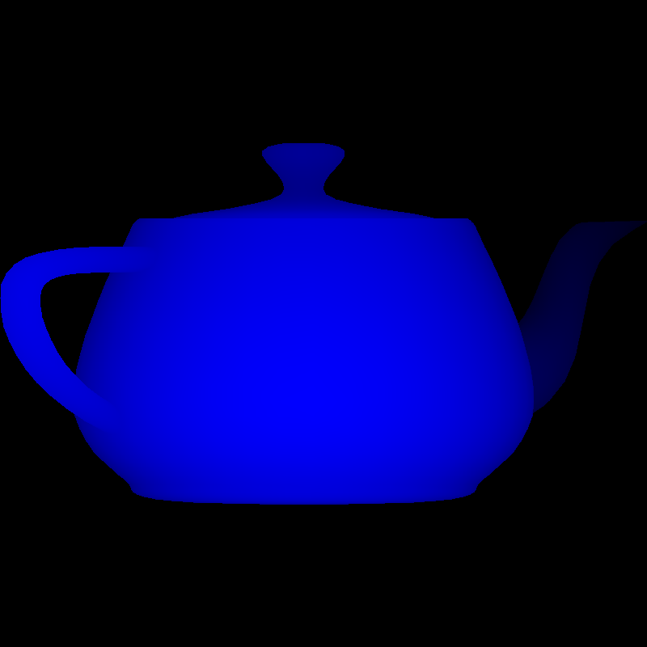

# superTinyRenderer

This repo is a little exercise in building a suuuuper basic C++ renderer from scratch that can read a `.obj` file then output a `.bmp` image

  
   
  <em>Figure 1: Output of the superTinyRenderer</em>

### Milestones:
- [x] draw a gradient on a `.bmp` file
- [x] follow the drawing triangles chapter of the tutorial
- [x] finish the wireframe of a demon example
- [x] finish barycentric coordinates shading
- [x] finish removing hidden faces chapter
- [x] refactor model code into an object
- [] refactor the 2 vertex classes into eigen library objects
- [] finish the "better camera" chapter

### Inspired By: (copied from)
- https://www.youtube.com/watch?v=yyJ-hdISgnw&t=2213s
- https://github.com/ssloy/tinyrenderer/wiki/Lesson-1:-Bresenham’s-Line-Drawing-Algorithm